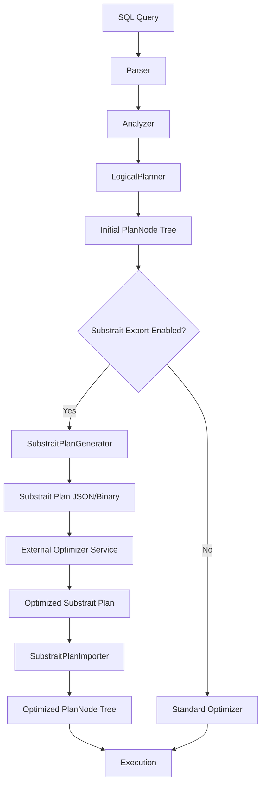

# Substrait Integration with Presto: Comprehensive Plan

## Executive Summary

This document outlines a comprehensive plan for integrating Substrait as a query plan language in Presto, enabling external query optimization through standardized plan exchange.

**Goal**: Enable Presto to generate Substrait query plans after SQL parsing and receive optimized plans from external systems for execution.

**Key Benefits**:
- Decouple query optimization from execution engine
- Enable external optimization services
- Facilitate cross-system query plan sharing
- Support heterogeneous optimization strategies
- Enable query plan federation and analysis

---

## 1. Technical Feasibility Analysis

### 1.1 Presto Query Plan Architecture

**Current Pipeline**:
```
SQL → Parser → Analyzer → LogicalPlanner → PlanNode Tree → Optimizer → Optimized Plan → Execution
```

**Key Components**:
- **SqlQueryExecution**: Orchestrates query execution (line 570-610)
- **LogicalPlanner**: Creates initial logical plan from analyzed SQL
- **Optimizer**: Applies optimization rules to PlanNode tree
- **PlanNode**: Base class for all plan nodes (tree structure)

**Core PlanNode Types**:
- `TableScanNode` - Read from tables
- `FilterNode` - Row filtering with predicates
- `ProjectNode` - Column projections and expressions
- `JoinNode` - Join operations (INNER, LEFT, RIGHT, FULL)
- `AggregationNode` - GROUP BY and aggregations
- `SortNode` - ORDER BY operations
- `LimitNode` - LIMIT/OFFSET
- `UnionNode`, `IntersectNode`, `ExceptNode` - Set operations

### 1.2 Substrait Architecture

**Core Concepts**:
- **Protocol Buffers**: Binary serialization format
- **Relations**: Operations (Read, Filter, Project, Join, Aggregate, etc.)
- **Expressions**: Scalar functions, field references, literals
- **Type System**: Rich type definitions with nullability
- **Extensions**: Function definitions in YAML files

**Key Mapping Observations**:

| Presto PlanNode | Substrait Relation | Complexity |
|-----------------|-------------------|------------|
| TableScanNode | ReadRel | Medium (schema mapping) |
| FilterNode | FilterRel | Medium (expression conversion) |
| ProjectNode | ProjectRel | High (keeps existing columns) |
| JoinNode | JoinRel | High (multiple join types) |
| AggregationNode | AggregateRel | High (grouping sets) |
| SortNode | SortRel | Low |
| LimitNode | FetchRel | Low |
| UnionNode | SetRel (UNION_ALL) | Medium |

**Feasibility Assessment**: ✅ **HIGHLY FEASIBLE**
- Strong structural alignment between Presto PlanNodes and Substrait Relations
- Both use tree-based representations
- Expression systems are compatible
- Type systems can be mapped with reasonable effort

### 1.3 Key Technical Challenges

#### Challenge 1: Field Reference Mapping
**Issue**: Substrait uses numeric indices (0, 1, 2...), Presto uses VariableReferenceExpression
**Solution**: Maintain bidirectional mapping between variable names and field indices

#### Challenge 2: Expression Translation
**Issue**: Presto RowExpression → Substrait Expression conversion
**Solution**: Build expression visitor pattern for recursive translation

#### Challenge 3: Type System Differences
**Issue**: Presto types vs Substrait types (e.g., VARCHAR vs string)
**Solution**: Create type mapping registry with conversion rules

#### Challenge 4: Function Resolution
**Issue**: Presto function signatures → Substrait extension functions
**Solution**: Map Presto functions to Substrait YAML function definitions

#### Challenge 5: Optimization Semantics
**Issue**: Ensuring external optimizer respects Presto semantics
**Solution**: Document semantic requirements, validate returned plans

---

## 2. Architecture Design

### 2.1 Integration Points



### 2.2 New Components

#### Component 1: SubstraitPlanGenerator
**Location**: `presto-substrait/src/main/java/com/facebook/presto/substrait/`

**Responsibilities**:
- Convert Presto PlanNode tree to Substrait Plan
- Maintain variable-to-index mapping
- Generate extension references
- Serialize to Protocol Buffer format

**Key Classes**:
```java
public class SubstraitPlanGenerator {
    public SubstraitPlan generate(PlanNode root, Session session);
    private Rel convertPlanNode(PlanNode node);
    private Expression convertRowExpression(RowExpression expr);
    private Type convertPrestoType(com.facebook.presto.common.type.Type type);
}
```

#### Component 2: SubstraitPlanImporter
**Location**: `presto-substrait/src/main/java/com/facebook/presto/substrait/`

**Responsibilities**:
- Parse Substrait Plan (JSON or binary)
- Convert Substrait Relations to PlanNodes
- Validate plan semantics
- Restore variable references

**Key Classes**:
```java
public class SubstraitPlanImporter {
    public PlanNode importPlan(SubstraitPlan plan, Session session);
    private PlanNode convertRelation(Rel relation);
    private RowExpression convertExpression(Expression expr);
    private VariableReferenceExpression resolveFieldReference(int index);
}
```

#### Component 3: ExternalOptimizerClient
**Location**: `presto-substrait/src/main/java/com/facebook/presto/substrait/optimizer/`

**Responsibilities**:
- Communicate with external optimization service
- Handle HTTP/gRPC protocol
- Manage timeouts and retries
- Validate responses

**Key Classes**:
```java
public interface ExternalOptimizerClient {
    SubstraitPlan optimize(SubstraitPlan plan, OptimizationContext context);
}

public class HttpExternalOptimizerClient implements ExternalOptimizerClient {
    // HTTP-based implementation
}
```

#### Component 4: SubstraitConfig
**Location**: `presto-substrait/src/main/java/com/facebook/presto/substrait/`

**Configuration Properties**:
```properties
substrait.enabled=false
substrait.export-only=false
substrait.optimizer.endpoint=http://localhost:8080/optimize
substrait.optimizer.timeout=30s
substrait.optimizer.retry-attempts=3
substrait.validation.strict=true
substrait.serialization.format=json  # or binary
```

### 2.3 Integration Flow

#### Flow 1: Export-Only Mode (for debugging/analysis)
```
1. SQL → Parser → Analyzer → LogicalPlanner
2. Generate initial PlanNode tree
3. Convert to Substrait plan
4. Export to file/endpoint
5. Continue with standard Presto optimization
6. Execute normally
```

#### Flow 2: External Optimization Mode
```
1. SQL → Parser → Analyzer → LogicalPlanner
2. Generate initial PlanNode tree
3. Convert to Substrait plan
4. Send to external optimizer
5. Receive optimized Substrait plan
6. Convert back to PlanNode tree
7. Validate plan
8. Execute optimized plan
```

#### Flow 3: Hybrid Mode
```
1. SQL → Parser → Analyzer → LogicalPlanner
2. Generate initial PlanNode tree
3. Apply Presto pre-optimization rules
4. Convert to Substrait plan
5. Send to external optimizer
6. Receive optimized Substrait plan
7. Convert back to PlanNode tree
8. Apply Presto post-optimization rules
9. Execute
```

---

## 3. Implementation Phases

### Phase 1: Foundation (4-6 weeks)

**Objectives**:
- Set up Substrait dependencies
- Create basic module structure
- Implement type system mapping

**Deliverables**:
- [ ] New Maven module: `presto-substrait`
- [ ] Add Substrait Protocol Buffer dependencies
- [ ] Implement `PrestoToSubstraitTypeConverter`
- [ ] Implement `SubstraitToPrestoTypeConverter`
- [ ] Unit tests for type conversions
- [ ] Documentation: Type mapping reference

**Key Files to Create**:
```
presto-substrait/
├── pom.xml
├── src/main/java/com/facebook/presto/substrait/
│   ├── SubstraitModule.java
│   ├── SubstraitConfig.java
│   ├── types/
│   │   ├── TypeConverter.java
│   │   ├── PrestoToSubstraitTypeConverter.java
│   │   └── SubstraitToPrestoTypeConverter.java
│   └── proto/ (generated from Substrait .proto files)
└── src/test/java/...
```

### Phase 2: Expression Translation (6-8 weeks)

**Objectives**:
- Implement expression conversion
- Handle field references
- Map Presto functions to Substrait

**Deliverables**:
- [ ] `ExpressionConverter` with visitor pattern
- [ ] Field reference index mapping
- [ ] Function signature mapping registry
- [ ] Literal value conversion
- [ ] Unit tests for all expression types
- [ ] Documentation: Expression mapping guide

**Key Classes**:
```java
public class PrestoToSubstraitExpressionConverter
    extends RowExpressionVisitor<Expression, Context> {

    @Override
    public Expression visitCall(CallExpression call, Context context);

    @Override
    public Expression visitVariableReference(
        VariableReferenceExpression variable, Context context);

    @Override
    public Expression visitConstant(ConstantExpression constant, Context context);
}
```

### Phase 3: Relation Translation (8-10 weeks)

**Objectives**:
- Convert all major PlanNode types
- Handle complex operations (joins, aggregations)
- Implement schema tracking

**Deliverables**:
- [ ] `PlanNodeToRelationConverter`
- [ ] Support for: TableScan, Filter, Project, Join, Aggregate
- [ ] Support for: Sort, Limit, Union, Intersect, Except
- [ ] Schema evolution tracking through plan tree
- [ ] Integration tests with sample queries
- [ ] Documentation: Relation mapping guide

**Priority Order**:
1. TableScanNode → ReadRel (foundation)
2. FilterNode → FilterRel (simple)
3. ProjectNode → ProjectRel (medium complexity)
4. JoinNode → JoinRel (complex)
5. AggregationNode → AggregateRel (complex)
6. SortNode → SortRel (simple)
7. LimitNode → FetchRel (simple)
8. Set operations (medium)

### Phase 4: Plan Generation & Serialization (4-6 weeks)

**Objectives**:
- Complete end-to-end plan generation
- Implement serialization
- Add extension management

**Deliverables**:
- [ ] `SubstraitPlanGenerator` (complete)
- [ ] Extension URI management
- [ ] Function anchor assignment
- [ ] JSON and binary serialization
- [ ] Plan validation
- [ ] End-to-end tests
- [ ] Documentation: Plan generation guide

### Phase 5: Plan Import & Validation (6-8 weeks)

**Objectives**:
- Implement reverse conversion (Substrait → Presto)
- Add semantic validation
- Handle optimization results

**Deliverables**:
- [ ] `SubstraitPlanImporter` (complete)
- [ ] Relation to PlanNode conversion
- [ ] Expression to RowExpression conversion
- [ ] Plan semantic validator
- [ ] Round-trip tests (Presto → Substrait → Presto)
- [ ] Documentation: Plan import guide

### Phase 6: External Optimizer Integration (4-6 weeks)

**Objectives**:
- Implement optimizer client
- Add configuration management
- Handle errors and fallbacks

**Deliverables**:
- [ ] `ExternalOptimizerClient` interface
- [ ] HTTP client implementation
- [ ] Configuration properties
- [ ] Timeout and retry logic
- [ ] Fallback to standard optimizer
- [ ] Integration tests with mock optimizer
- [ ] Documentation: External optimizer guide

### Phase 7: Testing & Optimization (6-8 weeks)

**Objectives**:
- Comprehensive testing
- Performance optimization
- Production readiness

**Deliverables**:
- [ ] TPC-H query suite tests
- [ ] TPC-DS query suite tests
- [ ] Performance benchmarks
- [ ] Memory profiling
- [ ] Error handling improvements
- [ ] Logging and monitoring
- [ ] Documentation: Operations guide

### Phase 8: Advanced Features (Optional, 8-12 weeks)

**Objectives**:
- Support advanced Presto features
- Optimize specific patterns
- Add tooling

**Deliverables**:
- [ ] Window functions support
- [ ] CTE (Common Table Expressions) support
- [ ] Materialized views integration
- [ ] Plan visualization tool
- [ ] Plan diff tool
- [ ] Substrait plan optimizer (standalone)
- [ ] Documentation: Advanced features guide

---

## 4. Detailed Component Specifications

### 4.1 SubstraitPlanGenerator

**Input**: Presto PlanNode tree
**Output**: Substrait Plan (Protocol Buffer)

**Algorithm**:
```
1. Initialize context (variable mapping, extension registry)
2. Traverse PlanNode tree (post-order)
3. For each node:
   a. Convert to Substrait Relation
   b. Update schema/field mappings
   c. Register required functions
4. Build extension URNs and anchors
5. Assemble complete Plan message
6. Serialize to Protocol Buffer
```

**Variable Mapping Strategy**:
```java
class VariableIndexMapper {
    private Map<VariableReferenceExpression, Integer> variableToIndex;
    private List<VariableReferenceExpression> indexToVariable;

    public int getIndex(VariableReferenceExpression var) {
        return variableToIndex.computeIfAbsent(var,
            v -> indexToVariable.size());
    }

    public VariableReferenceExpression getVariable(int index) {
        return indexToVariable.get(index);
    }
}
```

### 4.2 PlanNode to Relation Mapping Details

#### TableScanNode → ReadRel
```java
private ReadRel convertTableScan(TableScanNode node) {
    // 1. Get table metadata
    TableHandle table = node.getTable();
    SchemaTableName tableName = metadata.getTableName(table);

    // 2. Build NamedTable
    NamedTable namedTable = NamedTable.newBuilder()
        .addNames(tableName.getSchemaName())
        .addNames(tableName.getTableName())
        .build();

    // 3. Build base schema
    List<VariableReferenceExpression> outputs = node.getOutputVariables();
    NamedStruct schema = buildNamedStruct(outputs);

    // 4. Convert predicates (if any)
    Optional<Expression> filter = convertPredicate(node.getCurrentConstraint());

    return ReadRel.newBuilder()
        .setNamedTable(namedTable)
        .setBaseSchema(schema)
        .setFilter(filter.orElse(Expression.getDefaultInstance()))
        .build();
}
```

#### FilterNode → FilterRel
```java
private FilterRel convertFilter(FilterNode node) {
    // 1. Convert input relation
    Rel input = convertPlanNode(node.getSource());

    // 2. Convert predicate expression
    Expression condition = expressionConverter.convert(
        node.getPredicate(),
        variableMapper
    );

    return FilterRel.newBuilder()
        .setInput(input)
        .setCondition(condition)
        .build();
}
```

#### JoinNode → JoinRel
```java
private JoinRel convertJoin(JoinNode node) {
    // 1. Convert left and right inputs
    Rel left = convertPlanNode(node.getLeft());
    Rel right = convertPlanNode(node.getRight());

    // 2. Convert join type
    JoinRel.JoinType joinType = convertJoinType(node.getType());

    // 3. Build join expression from criteria
    Expression joinExpression = buildJoinExpression(
        node.getCriteria(),
        node.getFilter()
    );

    // 4. Handle post-join filter
    Optional<Expression> postJoinFilter = node.getFilter()
        .map(f -> expressionConverter.convert(f, variableMapper));

    return JoinRel.newBuilder()
        .setLeft(left)
        .setRight(right)
        .setType(joinType)
        .setExpression(joinExpression)
        .setPostJoinFilter(postJoinFilter.orElse(Expression.getDefaultInstance()))
        .build();
}
```

#### AggregationNode → AggregateRel
```java
private AggregateRel convertAggregation(AggregationNode node) {
    // 1. Convert input
    Rel input = convertPlanNode(node.getSource());

    // 2. Build grouping expressions
    List<Expression> groupings = node.getGroupingSets()
        .getGroupingKeys()
        .stream()
        .map(var -> expressionConverter.convertFieldReference(var, variableMapper))
        .collect(toList());

    // 3. Convert aggregate functions
    List<AggregateFunction> measures = node.getAggregations()
        .entrySet()
        .stream()
        .map(entry -> convertAggregateFunction(entry.getValue()))
        .collect(toList());

    return AggregateRel.newBuilder()
        .setInput(input)
        .addAllGroupings(groupings)
        .addAllMeasures(measures)
        .build();
}
```

### 4.3 Expression Conversion Details

**Presto RowExpression Types**:
- `CallExpression` - Function calls
- `VariableReferenceExpression` - Column references
- `ConstantExpression` - Literal values
- `LambdaDefinitionExpression` - Lambda functions
- `SpecialFormExpression` - Special forms (AND, OR, CAST, etc.)

**Substrait Expression Types**:
- `ScalarFunction` - Regular functions
- `Selection` - Field references
- `Literal` - Constant values
- `Cast` - Type conversions
- `IfThen` - Conditional expressions

**Conversion Examples**:

```java
// CallExpression → ScalarFunction
public Expression visitCall(CallExpression call, Context context) {
    FunctionHandle function = call.getFunctionHandle();
    String functionName = getFunctionName(function);

    // Look up function in extension registry
    int functionAnchor = extensionRegistry.getFunctionAnchor(functionName);

    // Convert arguments
    List<Expression> args = call.getArguments()
        .stream()
        .map(arg -> arg.accept(this, context))
        .collect(toList());

    return Expression.newBuilder()
        .setScalarFunction(ScalarFunction.newBuilder()
            .setFunctionReference(functionAnchor)
            .addAllArguments(args)
            .build())
        .build();
}

// VariableReferenceExpression → Selection (field reference)
public Expression visitVariableReference(
        VariableReferenceExpression variable, Context context) {
    int fieldIndex = context.getVariableMapper().getIndex(variable);

    return Expression.newBuilder()
        .setSelection(Selection.newBuilder()
            .setDirectReference(ReferenceSegment.newBuilder()
                .setStructField(StructField.newBuilder()
                    .setField(fieldIndex)
                    .build())
                .build())
            .build())
        .build();
}

// ConstantExpression → Literal
public Expression visitConstant(ConstantExpression constant, Context context) {
    Object value = constant.getValue();
    Type type = constant.getType();

    Literal.Builder literal = Literal.newBuilder();

    if (type instanceof IntegerType) {
        literal.setI32((Integer) value);
    } else if (type instanceof BigintType) {
        literal.setI64((Long) value);
    } else if (type instanceof VarcharType) {
        literal.setString((String) value);
    }
    // ... handle other types

    return Expression.newBuilder()
        .setLiteral(literal.build())
        .build();
}
```

### 4.4 Function Mapping Strategy

**Approach**: Create a mapping registry between Presto functions and Substrait extension functions.

```java
public class FunctionMappingRegistry {
    private static final Map<String, SubstraitFunction> FUNCTION_MAP =
        ImmutableMap.<String, SubstraitFunction>builder()
            // Arithmetic
            .put("presto.default.add",
                new SubstraitFunction("functions_arithmetic", "add"))
            .put("presto.default.subtract",
                new SubstraitFunction("functions_arithmetic", "subtract"))
            .put("presto.default.multiply",
                new SubstraitFunction("functions_arithmetic", "multiply"))
            .put("presto.default.divide",
                new SubstraitFunction("functions_arithmetic", "divide"))

            // Comparison
            .put("presto.default.equal",
                new SubstraitFunction("functions_comparison", "equal"))
            .put("presto.default.not_equal",
                new SubstraitFunction("functions_comparison", "not_equal"))
            .put("presto.default.less_than",
                new SubstraitFunction("functions_comparison", "lt"))
            .put("presto.default.greater_than",
                new SubstraitFunction("functions_comparison", "gt"))

            // String functions
            .put("presto.default.concat",
                new SubstraitFunction("functions_string", "concat"))
            .put("presto.default.substring",
                new SubstraitFunction("functions_string", "substring"))
            .put("presto.default.upper",
                new SubstraitFunction("functions_string", "upper"))
            .put("presto.default.lower",
                new SubstraitFunction("functions_string", "lower"))

            // Aggregate functions
            .put("presto.default.sum",
                new SubstraitFunction("functions_aggregate_generic", "sum"))
            .put("presto.default.count",
                new SubstraitFunction("functions_aggregate_generic", "count"))
            .put("presto.default.avg",
                new SubstraitFunction("functions_aggregate_generic", "avg"))
            .put("presto.default.min",
                new SubstraitFunction("functions_aggregate_generic", "min"))
            .put("presto.default.max",
                new SubstraitFunction("functions_aggregate_generic", "max"))

            .build();

    public SubstraitFunction getSubstraitFunction(String prestoFunction) {
        return FUNCTION_MAP.get(prestoFunction);
    }
}

class SubstraitFunction {
    private final String extensionUri;
    private final String functionName;

    public String getFullUri() {
        return "extension:io.substrait:" + extensionUri;
    }
}
```

---

## 5. Configuration & Deployment

### 5.1 Configuration Properties

```properties
# Enable Substrait integration
substrait.enabled=false

# Export mode: export plans without external optimization
substrait.export-only=false
substrait.export-path=/var/presto/substrait-plans

# External optimizer configuration
substrait.optimizer.enabled=false
substrait.optimizer.endpoint=http://localhost:8080/optimize
substrait.optimizer.timeout=30s
substrait.optimizer.retry-attempts=3
substrait.optimizer.fallback-on-error=true

# Serialization format
substrait.serialization.format=json  # json or binary

# Validation
substrait.validation.strict=true
substrait.validation.check-semantics=true

# Logging
substrait.logging.log-plans=false
substrait.logging.log-conversions=false
substrait.logging.log-optimizer-calls=true
```

### 5.2 Session Properties

```sql
-- Enable for specific session
SET SESSION substrait_enabled = true;

-- Export only mode
SET SESSION substrait_export_only = true;

-- Override optimizer endpoint
SET SESSION substrait_optimizer_endpoint = 'http://custom-optimizer:8080/optimize';

-- Enable detailed logging
SET SESSION substrait_logging_enabled = true;
```

### 5.3 Deployment Scenarios

#### Scenario 1: Development/Testing
```
Purpose: Test Substrait plan generation
Configuration:
  substrait.enabled=true
  substrait.export-only=true
  substrait.export-path=/tmp/substrait-plans
```

#### Scenario 2: External Optimizer (HTTP)
```
Purpose: Use external HTTP-based optimizer
Configuration:
  substrait.enabled=true
  substrait.optimizer.enabled=true
  substrait.optimizer.endpoint=http://optimizer-service:8080/optimize
  substrait.optimizer.fallback-on-error=true
```

#### Scenario 3: External Optimizer (gRPC)
```
Purpose: Use external gRPC-based optimizer
Configuration:
  substrait.enabled=true
  substrait.optimizer.enabled=true
  substrait.optimizer.endpoint=grpc://optimizer-service:9090
  substrait.optimizer.protocol=grpc
```

---

## 6. Challenges & Solutions

### Challenge 1: Semantic Preservation

**Problem**: Ensuring external optimizer preserves Presto semantics

**Solutions**:
1. **Validation Layer**: Implement strict validation of returned plans
2. **Semantic Annotations**: Add Presto-specific metadata to Substrait plans
3. **Constraint Specification**: Document optimization constraints
4. **Test Suite**: Comprehensive tests comparing results

**Implementation**:
```java
public class SubstraitPlanValidator {
    public ValidationResult validate(
            PlanNode originalPlan,
            PlanNode optimizedPlan,
            Session session) {

        // Check output schema matches
        if (!schemasMatch(originalPlan, optimizedPlan)) {
            return ValidationResult.failure("Schema mismatch");
        }

        // Check semantic equivalence
        if (!semanticallyEquivalent(originalPlan, optimizedPlan)) {
            return ValidationResult.failure("Semantic mismatch");
        }

        // Check Presto-specific constraints
        if (!prestoConstraintsSatisfied(optimizedPlan, session)) {
            return ValidationResult.failure("Presto constraints violated");
        }

        return ValidationResult.success();
    }
}
```

### Challenge 2: Performance Overhead

**Problem**: Conversion overhead may impact query latency

**Solutions**:
1. **Caching**: Cache converted plans for repeated queries
2. **Async Optimization**: Optimize in background for future queries
3. **Selective Optimization**: Only optimize complex queries
4. **Incremental Conversion**: Convert only modified parts

**Implementation**:
```java
public class CachedSubstraitPlanGenerator {
    private final LoadingCache<PlanCacheKey, SubstraitPlan> cache;

    public SubstraitPlan generate(PlanNode plan, Session session) {
        PlanCacheKey key = PlanCacheKey.from(plan, session);
        return cache.get(key, () -> actuallyGenerate(plan, session));
    }
}
```

### Challenge 3: Incomplete Feature Coverage

**Problem**: Not all Presto features may map to Substrait

**Solutions**:
1. **Phased Rollout**: Start with common operations
2. **Fallback Mechanism**: Use standard optimizer for unsupported features
3. **Extension Mechanism**: Define custom Substrait extensions
4. **Feature Detection**: Detect unsupported features early

**Implementation**:
```java
public class FeatureDetector {
    public boolean isSubstraitCompatible(PlanNode plan) {
        return plan.accept(new PlanVisitor<Boolean, Void>() {
            @Override
            public Boolean visitTableScan(TableScanNode node, Void context) {
                return true;  // Supported
            }

            @Override
            public Boolean visitWindow(WindowNode node, Void context) {
                return false;  // Not yet supported
            }

            // ... check all node types
        }, null);
    }
}
```

### Challenge 4: Error Handling & Debugging

**Problem**: Debugging issues across system boundaries

**Solutions**:
1. **Detailed Logging**: Log all conversions and optimizer calls
2. **Plan Visualization**: Tools to visualize Substrait plans
3. **Diff Tools**: Compare original and optimized plans
4. **Metrics**: Track conversion success rates and performance

**Implementation**:
```java
public class SubstraitMetrics {
    private final Counter conversionsAttempted;
    private final Counter conversionsSucceeded;
    private final Counter conversionsFailed;
    private final Timer conversionTime;
    private final Timer optimizationTime;

    public void recordConversion(boolean success, Duration duration) {
        conversionsAttempted.inc();
        if (success) {
            conversionsSucceeded.inc();
        } else {
            conversionsFailed.inc();
        }
        conversionTime.update(duration);
    }
}
```

### Challenge 5: Version Compatibility

**Problem**: Substrait specification evolves over time

**Solutions**:
1. **Version Detection**: Check Substrait version in plans
2. **Backward Compatibility**: Support multiple Substrait versions
3. **Version Negotiation**: Negotiate version with optimizer
4. **Upgrade Path**: Clear migration strategy

**Implementation**:
```java
public class SubstraitVersionManager {
    private static final Version MIN_SUPPORTED = Version.of(0, 42, 0);
    private static final Version MAX_SUPPORTED = Version.of(0, 50, 0);

    public boolean isSupported(Version version) {
        return version.compareTo(MIN_SUPPORTED) >= 0
            && version.compareTo(MAX_SUPPORTED) <= 0;
    }

    public SubstraitPlan convertToVersion(
            SubstraitPlan plan,
            Version targetVersion) {
        // Version conversion logic
    }
}
```

---

## 7. Testing Strategy

### 7.1 Unit Tests

**Coverage Areas**:
- Type conversion (Presto ↔ Substrait)
- Expression conversion
- Individual relation conversions
- Function mapping
- Serialization/deserialization

**Example Test**:
```java
@Test
public void testFilterNodeConversion() {
    // Create Presto FilterNode
    FilterNode filterNode = createTestFilterNode();

    // Convert to Substrait
    SubstraitPlan plan = generator.generate(filterNode, session);

    // Verify structure
    assertThat(plan.getRelationsCount()).isEqualTo(1);
    Rel rel = plan.getRelations(0).getRoot().getInput();
    assertThat(rel.hasFilter()).isTrue();

    // Convert back to Presto
    PlanNode converted = importer.importPlan(plan, session);

    // Verify equivalence
    assertThat(converted).isInstanceOf(FilterNode.class);
    assertPlansEquivalent(filterNode, converted);
}
```

### 7.2 Integration Tests

**Test Scenarios**:
- End-to-end query execution with Substrait
- Round-trip conversion (Presto → Substrait → Presto)
- External optimizer integration (with mock)
- Error handling and fallback
- Performance benchmarks

**Example Test**:
```java
@Test
public void testEndToEndQueryWithSubstrait() {
    // Enable Substrait
    Session session = Session.builder(getSession())
        .setSystemProperty("substrait_enabled", "true")
        .build();

    // Execute query
    String query = "SELECT * FROM orders WHERE quantity > 10";
    MaterializedResult result = computeActual(session, query);

    // Verify results match standard execution
    MaterializedResult expected = computeActual(query);
    assertThat(result).isEqualTo(expected);

    // Verify Substrait plan was generated
    assertThat(getSubstraitPlanCount()).isGreaterThan(0);
}
```

### 7.3 TPC Benchmark Tests

**Benchmarks**:
- TPC-H (22 queries)
- TPC-DS (99 queries)

**Metrics**:
- Correctness: Results match standard execution
- Performance: Overhead < 5% for conversion
- Coverage: % of queries successfully converted

### 7.4 Compatibility Tests

**Test Matrix**:
- Presto versions: Current, Previous, Next
- Substrait versions: 0.42.0, 0.45.0, 0.50.0
- External optimizers: Mock, Apache Calcite, Custom

---

## 8. Documentation Requirements

### 8.1 User Documentation

1. **Getting Started Guide**
   - Installation instructions
   - Basic configuration
   - First query with Substrait

2. **Configuration Reference**
   - All configuration properties
   - Session properties
   - Environment variables

3. **External Optimizer Integration Guide**
   - API specification
   - Request/response format
   - Error handling
   - Example implementations

4. **Troubleshooting Guide**
   - Common issues
   - Debugging techniques
   - Performance tuning

### 8.2 Developer Documentation

1. **Architecture Overview**
   - Component diagram
   - Data flow
   - Extension points

2. **API Reference**
   - SubstraitPlanGenerator API
   - SubstraitPlanImporter API
   - ExternalOptimizerClient API

3. **Mapping Reference**
   - Type mapping table
   - Function mapping table
   - Relation mapping table

4. **Contributing Guide**
   - Adding new relation types
   - Adding new function mappings
   - Testing guidelines

### 8.3 Operations Documentation

1. **Deployment Guide**
   - Installation steps
   - Configuration examples
   - Monitoring setup

2. **Monitoring & Metrics**
   - Key metrics to track
   - Alert thresholds
   - Dashboard examples

3. **Performance Tuning**
   - Optimization tips
   - Cache configuration
   - Resource allocation

---

## 9. Success Criteria

### 9.1 Functional Requirements

✅ **Must Have**:
- [ ] Convert basic SELECT queries to Substrait
- [ ] Support WHERE clauses (filters)
- [ ] Support JOIN operations (INNER, LEFT, RIGHT)
- [ ] Support GROUP BY and aggregations
- [ ] Support ORDER BY and LIMIT
- [ ] Round-trip conversion preserves semantics
- [ ] Integration with external optimizer via HTTP

✅ **Should Have**:
- [ ] Support all TPC-H queries
- [ ] Support window functions
- [ ] Support CTEs
- [ ] Support subqueries
- [ ] gRPC optimizer integration
- [ ] Plan caching

✅ **Nice to Have**:
- [ ] Support all TPC-DS queries
- [ ] Async optimization
- [ ] Plan visualization tool
- [ ] Multiple optimizer backends

### 9.2 Performance Requirements

- Conversion overhead: < 5% of query execution time
- Round-trip accuracy: 100% for supported features
- External optimizer timeout: Configurable, default 30s
- Cache hit rate: > 80% for repeated queries

### 9.3 Quality Requirements

- Unit test coverage: > 80%
- Integration test coverage: > 70%
- TPC-H correctness: 100%
- Documentation completeness: 100%

---

## 10. Timeline & Resources

### 10.1 Estimated Timeline

**Total Duration**: 40-60 weeks (10-15 months)

**Phase Breakdown**:
- Phase 1 (Foundation): 4-6 weeks
- Phase 2 (Expressions): 6-8 weeks
- Phase 3 (Relations): 8-10 weeks
- Phase 4 (Generation): 4-6 weeks
- Phase 5 (Import): 6-8 weeks
- Phase 6 (Optimizer): 4-6 weeks
- Phase 7 (Testing): 6-8 weeks
- Phase 8 (Advanced): 8-12 weeks (optional)

### 10.2 Resource Requirements

**Team Composition**:
- 2-3 Senior Engineers (full-time)
- 1 Tech Lead (full-time)
- 1 QA Engineer (part-time)
- 1 Technical Writer (part-time)

**Skills Required**:
- Deep Presto internals knowledge
- Protocol Buffers experience
- Query optimization expertise
- Distributed systems experience

### 10.3 Milestones

**M1 (Week 6)**: Type system mapping complete
**M2 (Week 14)**: Expression conversion complete
**M3 (Week 24)**: Basic relation conversion complete
**M4 (Week 30)**: End-to-end plan generation working
**M5 (Week 38)**: Plan import and validation complete
**M6 (Week 44)**: External optimizer integration complete
**M7 (Week 52)**: Production-ready with TPC-H support

---

## 11. Risk Assessment

### High Risk Items

1. **Semantic Mismatch**
   - Risk: External optimizer changes query semantics
   - Mitigation: Strict validation, comprehensive testing
   - Contingency: Fallback to standard optimizer

2. **Performance Degradation**
   - Risk: Conversion overhead impacts latency
   - Mitigation: Caching, selective optimization
   - Contingency: Make feature optional

3. **Incomplete Coverage**
   - Risk: Not all Presto features supported
   - Mitigation: Phased rollout, feature detection
   - Contingency: Hybrid mode with fallback

### Medium Risk Items

4. **External Optimizer Availability**
   - Risk: Optimizer service downtime
   - Mitigation: Retry logic, circuit breaker
   - Contingency: Automatic fallback

5. **Version Incompatibility**
   - Risk: Substrait version changes break integration
   - Mitigation: Version detection, backward compatibility
   - Contingency: Support multiple versions

### Low Risk Items

6. **Documentation Gaps**
   - Risk: Insufficient documentation
   - Mitigation: Continuous documentation updates
   - Contingency: Community contributions

---

## 12. Next Steps

### Immediate Actions (Week 1-2)

1. **Stakeholder Approval**
   - Present plan to Presto maintainers
   - Get feedback and buy-in
   - Adjust plan based on feedback

2. **Environment Setup**
   - Set up development environment
   - Clone Substrait repository
   - Study Substrait examples

3. **Proof of Concept**
   - Create minimal example
   - Convert simple SELECT query
   - Validate approach

### Short-term Actions (Week 3-8)

4. **Module Creation**
   - Create presto-substrait module
   - Add dependencies
   - Set up build configuration

5. **Type System Implementation**
   - Implement type converters
   - Write unit tests
   - Document mappings

6. **Community Engagement**
   - Join Substrait community
   - Share integration plans
   - Seek feedback

---

## 13. Conclusion

Integrating Substrait as a query plan language in Presto is **technically feasible** and offers significant benefits for query optimization flexibility. The proposed architecture provides:

✅ **Clear separation of concerns** between plan generation and optimization
✅ **Backward compatibility** with existing Presto functionality
✅ **Extensibility** for future enhancements
✅ **Production-ready design** with proper error handling and fallbacks

**Key Success Factors**:
1. Strong alignment between Presto and Substrait architectures
2. Phased implementation approach
3. Comprehensive testing strategy
4. Clear documentation and examples
5. Active community engagement

**Recommended Approach**: Start with Phase 1 (Foundation) as a proof of concept, validate the approach with stakeholders, then proceed with full implementation based on feedback and results.

---

## Appendix A: Reference Materials

### Presto Resources
- Presto Architecture: `/presto/ARCHITECTURE.md`
- LogicalPlanner: `/presto/presto-main-base/src/main/java/com/facebook/presto/sql/planner/LogicalPlanner.java`
- PlanNode: `/presto/presto-spi/src/main/java/com/facebook/presto/spi/plan/PlanNode.java`
- Optimizer: `/presto/presto-main-base/src/main/java/com/facebook/presto/sql/Optimizer.java`

### Substrait Resources
- Substrait Tutorial: `/substrait/BEGINNER_TUTORIAL.md`
- Substrait Specification: `https://substrait.io`
- Protocol Buffers: `/substrait/proto/`
- Function Definitions: `/substrait/extensions/`

### External Tools
- substrait-validator: `https://github.com/substrait-io/substrait-validator`
- Apache Calcite: `https://calcite.apache.org/`
- Apache Arrow: `https://arrow.apache.org/`

---

**Document Version**: 1.0
**Last Updated**: 2026-02-06
**Author**: Planning Mode Analysis
**Status**: Draft for Review